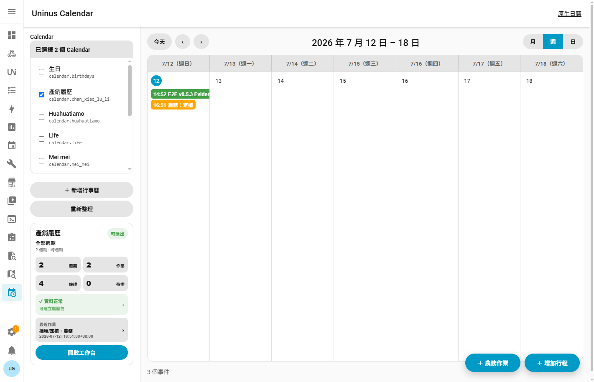
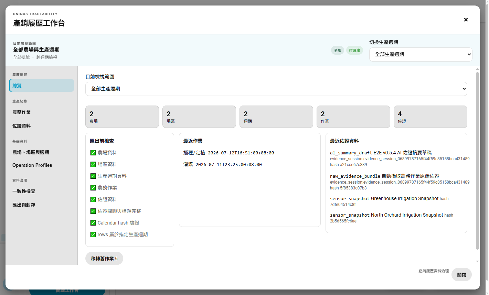
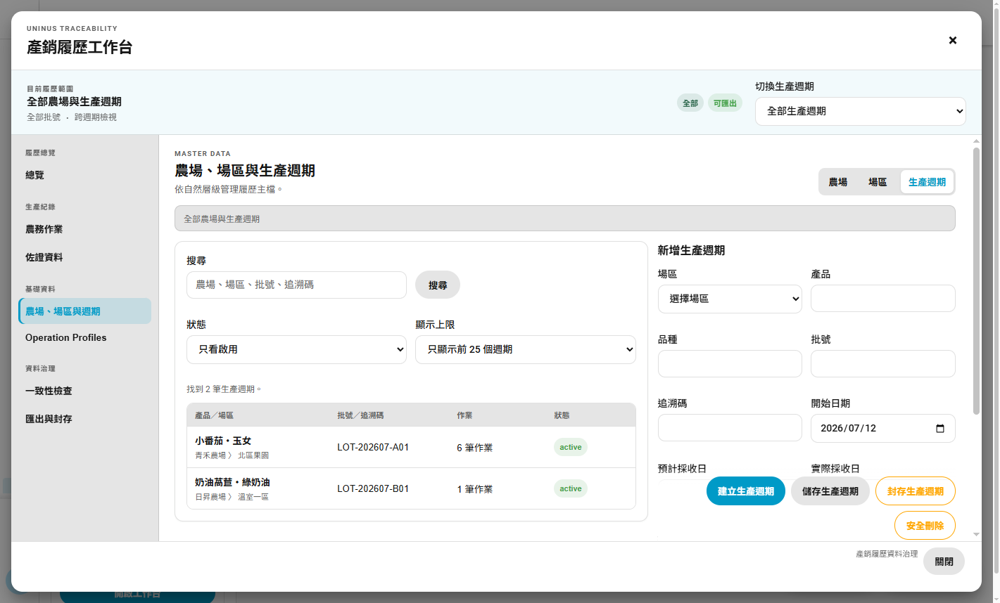
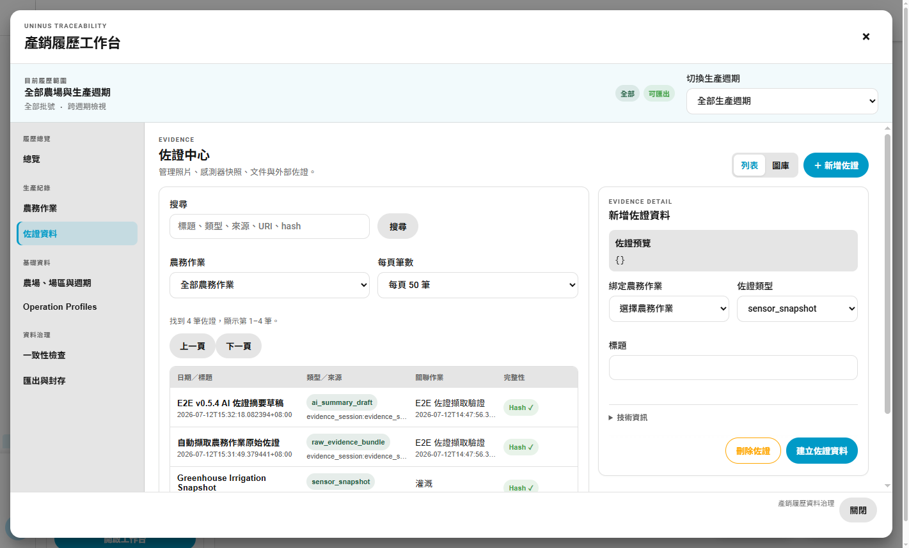
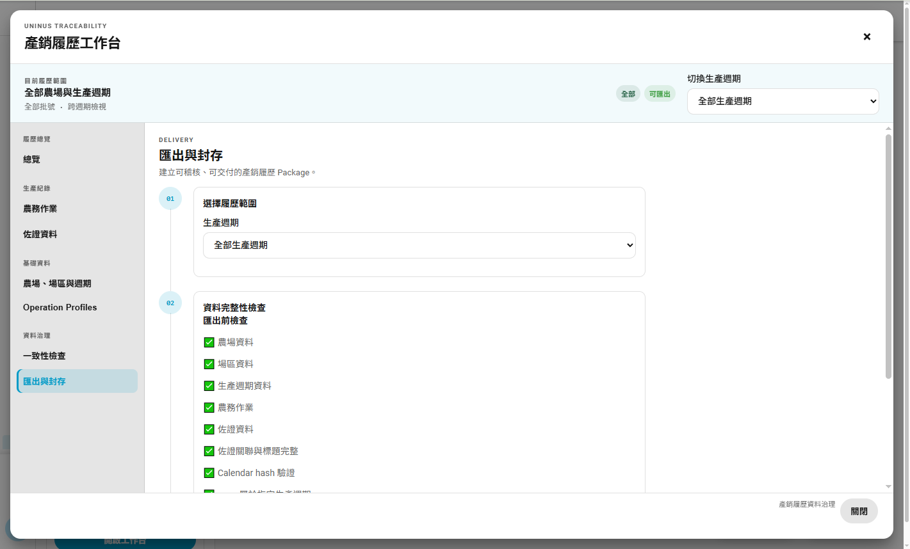

# Uninus Calendar 產銷履歷輔助系統使用操作說明

適用版本：v0.5.6  
文件日期：2026-07-12

本文件依 Uninus Calendar v0.5.6 的資料模型、目前 Home Assistant live UI 與 E2E 驗證結果完整重寫。Word 版位於同目錄：`Uninus Calendar 產銷履歷輔助系統使用操作說明.docx`。

## 文件內容

- 產銷履歷的目的、資料鏈與系統輔助方式
- 農場、場區、生產週期、農務作業的所有欄位用途、填寫方式與範例
- Operation Profiles：Observed / Control entities、開始／結束 Actions 與 evidence policy
- Evidence Session、Raw Evidence Bundle、內容 hash 與不可變原始證據
- AI-generated 佐證草稿、來源 hash 與人工接受／退回流程
- 一致性治理、安全封存、JSON Package 與 CSV 匯出
- 從首次建置到交付封存的完整 E2E 操作流程與驗收清單
- 6 張目前 v0.5.6 live UI 截圖：主畫面、總覽、主資料、佐證，以及匯出與封存流程

## 截圖

